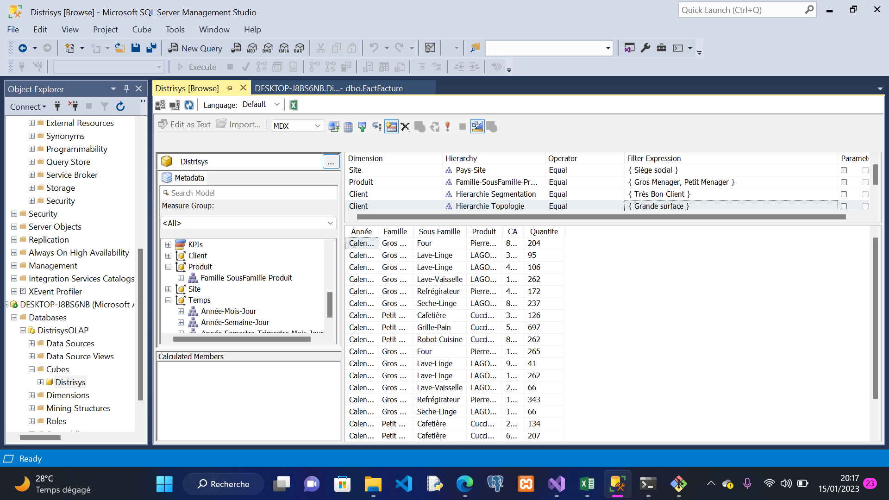
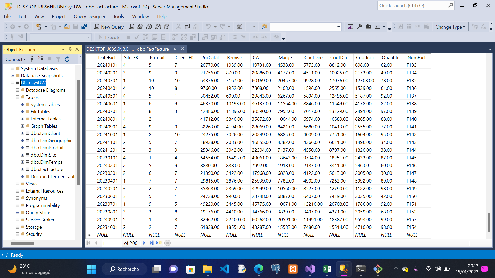
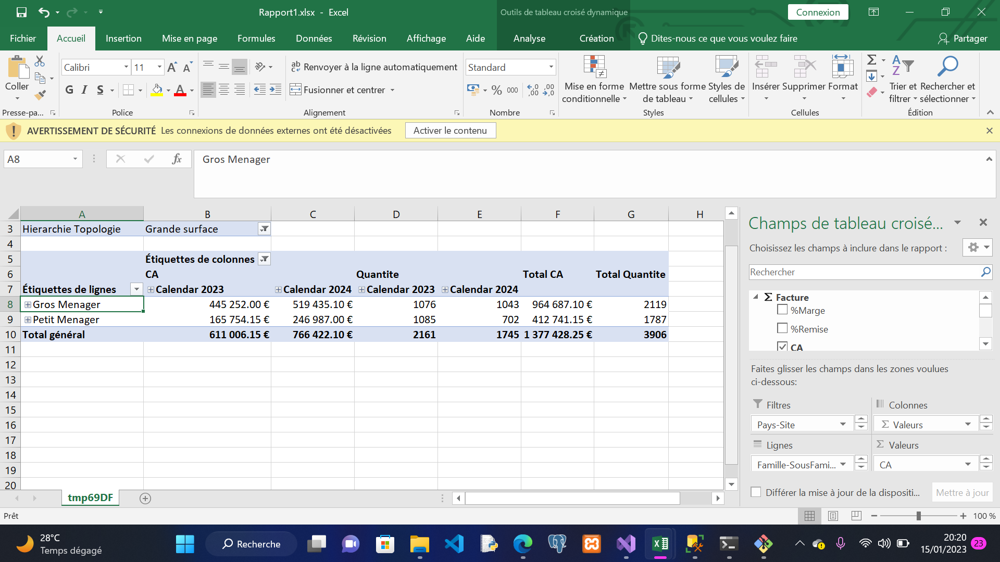
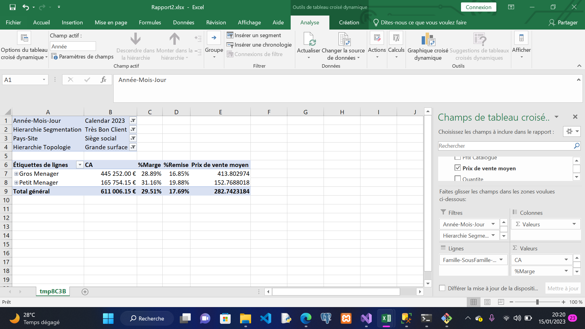

### Projet d'Outils décisionnels 

#### Liste des membres
- [FIAGNIGBE Bonkey](https://github.com/devBonkey)
- [HOUNSI Madouvi Antoine-Sébastien](https://github.com/Totorino02)
- [RABE SIBLI Christelle Fatim Alexandra](https://github.com/overflow-lady)

#### Description du projet

```
.....
```

#### Lien vers la vidéo Récapitulative

[Résumé en vidéo](./resume_projet-od.mp4)

#### Resultats Obtenus

###### Analyse des données du cube suivant certains axes


###### données de la table Facture 


###### Rapport 1


###### Rapport 2

